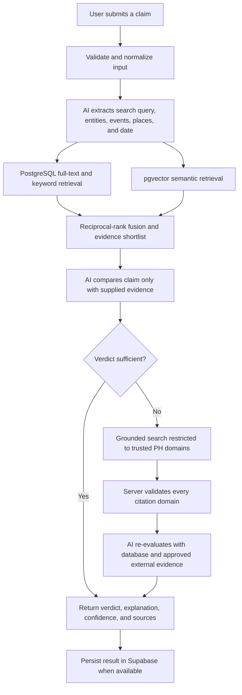
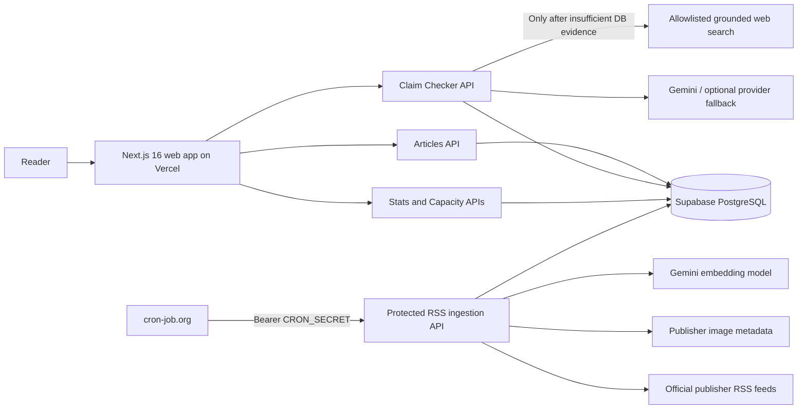

<div align="center">
  

  # VerifyPH

  **Evidence before virality.**

  An evidence-first Philippine news aggregator and AI-assisted claim checker built to help readers examine online claims against reporting from trusted local publishers.

  [Live Demo](https://verify-ph.vercel.app/) · [HackSocial 2026](https://hacksocial2026.devpost.com/) · [Report an Issue](https://github.com/Eunice-13/verify-ph/issues) · [Contribute](CONTRIBUTING.md)

  
  
  
  
  
</div>

---

## Table of contents

- [Why VerifyPH](#why-verifyph)
- [What it does](#what-it-does)
- [How the claim checker works](#how-the-claim-checker-works)
- [System architecture](#system-architecture)
- [News and evidence sources](#news-and-evidence-sources)
- [Technology stack](#technology-stack)
- [Database design](#database-design)
- [Project structure](#project-structure)
- [Getting started](#getting-started)
- [API reference](#api-reference)
- [Background ingestion](#background-ingestion)
- [Testing and evaluation](#testing-and-evaluation)
- [Deployment](#deployment)
- [Security, privacy, and responsible AI](#security-privacy-and-responsible-ai)
- [HackSocial 2026](#hacksocial-2026)
- [Current limitations and roadmap](#current-limitations-and-roadmap)
- [Contributing and license](#contributing-and-license)

## Why VerifyPH

False or misleading posts can spread faster than corrections, especially when a screenshot, recycled headline, or out-of-context number is shared without its original source. Readers are then forced to search across several news sites, compare dates and figures, and decide whether the available reporting actually supports the claim.

VerifyPH brings that process into one transparent workflow:

1. It continuously gathers reporting from established Philippine news publishers.
2. It organizes that reporting into a searchable evidence database.
3. It retrieves articles related to a user-submitted claim.
4. It asks an AI model to compare the claim only with the evidence supplied to it.
5. It returns a simple verdict, explanation, confidence score, and direct source links.

The goal is not to make an AI the final authority on truth. The goal is to help a reader reach the underlying evidence faster and understand why a claim is supported, contradicted, or not yet verifiable.

## What it does

### Curated Philippine news feed

- Aggregates official RSS feeds from trusted local publishers.
- Normalizes titles, summaries, dates, categories, source links, and publisher images.
- Deduplicates articles using the canonical source URL.
- Sorts stories into **Economy**, **Health & Safety**, **Lifestyle**, and **News & Politics**.
- Provides a **General / For You** view that combines stories rather than storing `General` as a database category.
- Links every card back to the original publisher.
- Falls back to a publisher-specific or neutral visual when an article image cannot be retrieved reliably.

### Searchable article database

- Searches article titles and summaries stored in Supabase.
- Supports category filters, pagination, featured stories, and strict whole-word matching in the public search experience.
- Uses PostgreSQL full-text search for claim evidence retrieval.
- Can combine lexical results with pgvector semantic similarity when article embeddings are available.

### Evidence-based claim checker

- Accepts a claim, headline, quotation, or pasted link text of up to 5,000 characters.
- Understands English, Filipino, and common Taglish phrasing used in Philippine social media posts.
- Extracts relevant entities, locations, events, dates, and search terms.
- Retrieves candidate evidence before asking the model for a verdict.
- Returns exactly one of three verdicts:

| Verdict | Meaning |
| --- | --- |
| **Verified** | The retrieved evidence supports the substance of the claim. Small rounding differences may be explained rather than treated as contradictions. |
| **Contradicted** | Relevant evidence materially conflicts with the claim, including important differences in facts, figures, or dates. |
| **Insufficient Evidence** | The available trusted evidence is missing, unrelated, or not strong enough to support either of the other verdicts. |

Each completed result can be persisted in Supabase and contributes to the homepage counts for claims checked, verified claims, and contradicted claims.

> **Important terminology:** the `VERIFIED` label on a news-feed card means the article came through VerifyPH's trusted-source ingestion pipeline. It does not mean VerifyPH independently fact-checked every statement in that publisher's article. Claim-checker verdicts are a separate feature.

### Resilience under model limits

- Detects provider quota and rate-limit failures.
- Applies short or long cooldowns depending on the failure type.
- Can optionally rotate structured claim parsing and verdict generation through Backboard-routed fallback models.
- Persists provider cooldowns in Supabase so they survive serverless restarts and redeployments.
- Exposes capacity status to the interface so users receive a clear availability message instead of an unexplained failure.

## How the claim checker works



### 1. Claim understanding

The server asks the language model to convert the user's text into a neutral normalized claim and a structured set of:

- search keywords;
- named people, agencies, and organizations;
- locations;
- events or actions; and
- an asserted date, including resolved relative phrases such as “yesterday.”

### 2. Hybrid evidence retrieval

VerifyPH searches its own `articles` table before producing a verdict:

- **Full-text search** finds exact names, events, and phrases in titles and summaries.
- **Categorized keyword matching** requires meaningful overlap across locations, events, and entities, reducing false matches caused by a shared place name alone.
- **Taglish expansion** maps common Filipino terms and abbreviations to words likely to appear in publisher reporting.
- **Semantic search** embeds the claim and compares it with 768-dimensional article vectors through pgvector.
- **Reciprocal rank fusion** combines lexical and semantic rankings without depending on incomparable raw scores.

Only the highest-ranked candidates are sent to the verdict model.

### 3. Evidence-constrained reasoning

The verdict prompt requires the model to:

- use only the supplied evidence;
- return one of the three fixed verdict labels;
- leave the source list empty when no article is relevant;
- preserve the exact source URLs supplied by the server;
- explain material numeric differences and normal rounding tolerance;
- flag old stories reshared as if they were current; and
- cite the specific reporting that supports its conclusion.

### 4. Trusted web fallback

If database evidence still produces **Insufficient Evidence**, VerifyPH may use Gemini's Google Search grounding to look for the same event on a fixed allowlist of Philippine news domains. This fallback is intentionally narrow:

1. The model is instructed to search only approved outlets.
2. The server independently validates every returned hostname.
3. Citations from all other domains are discarded.
4. The verdict model still receives only the approved evidence list.

This allows newly published or previously uningested reporting to be considered without treating arbitrary blogs or social media posts as evidence.

## System architecture



### End-to-end data flow

1. A scheduled request reaches the protected ingestion endpoint.
2. The server fetches up to 50 recent items from each configured official feed.
3. It validates and normalizes each article, classifies its topic, and attempts to extract a publisher-provided image.
4. Supabase rejects duplicate `source_url` values, while the ingestion code updates category changes when necessary.
5. New or meaningfully updated articles receive semantic embeddings when the embedding service is available.
6. The public feed and search API read the stored article metadata.
7. The claim checker retrieves stored articles, reasons over the shortlist, and persists the final result.

Embedding or image extraction failures do not discard the news article. The row remains usable through lexical search and can be repaired later by an idempotent backfill script.

## News and evidence sources

### RSS ingestion publishers

VerifyPH currently reads **24 official section feeds** across seven Philippine publishers:

- GMA News
- Philippine Daily Inquirer
- Rappler
- Philstar
- Manila Bulletin
- BusinessWorld
- VERA Files

The source allowlist is stored in [`src/lib/sources.ts`](src/lib/sources.ts). Categories are assigned per article rather than permanently tying an entire publisher to one topic.

### Additional trusted-web fallback domains

The fallback allowlist also includes selected established outlets that are not yet fully represented in the RSS pipeline, such as ABS-CBN News, The Manila Times, Philippine News Agency, CNN Philippines / RPTV, and SunStar Philippines. The code-level allowlist remains the source of truth.

Publisher inclusion means VerifyPH accepts the outlet as an evidence source; it does not imply endorsement of every article or editorial position.

## Technology stack

| Layer | Technology | Purpose |
| --- | --- | --- |
| Web application | Next.js 16 App Router, React 19, TypeScript | Server-rendered UI, API routes, and application logic |
| Styling and motion | Tailwind CSS 4, Framer Motion, Lucide React | Responsive interface, interaction, and icons |
| Database | Supabase PostgreSQL | Articles, claim results, indexes, policies, and provider cooldowns |
| Search | PostgreSQL full-text search, `pg_trgm`, pgvector HNSW | Lexical, typo-tolerant foundation, and semantic retrieval |
| AI | Google Gemini API | Claim parsing, embeddings, evidence comparison, and grounded fallback search |
| Optional AI resilience | Backboard | Routes parsing and verdict requests to fallback models during provider limits |
| Ingestion | `rss-parser`, publisher metadata extraction | Scheduled article collection and normalization |
| Hosting | Vercel | Next.js deployment and serverless API execution |
| Scheduling | cron-job.org | Authenticated recurring calls to the ingestion endpoint |

## Database design

### `articles`

Stores normalized publisher metadata:

- UUID primary key;
- unique canonical `source_url` for deduplication;
- title, summary, optional body, source name, and publication date;
- one of four real content categories;
- optional original-publisher image URL; and
- optional 768-dimensional Gemini embedding.

Public clients may read article metadata through row-level security. Normal application queries intentionally exclude raw embedding vectors.

### `claims`

Stores completed claim-check attempts:

- original user text;
- processing status;
- one of the three verdicts;
- evidence-based explanation;
- cited sources as JSON;
- confidence score; and
- processing timestamps.

There is no public database policy for claim rows. They are read and written through trusted server-side code using the service role.

### `provider_cooldowns`

Stores model-provider availability windows so rate-limit decisions remain consistent across Vercel function instances and redeployments. This table is also server-only.

### Search indexes and RPC

- Publication-date and category indexes support the news feed.
- GIN trigram indexes prepare title and summary fields for typo-tolerant matching.
- An HNSW cosine index supports approximate nearest-neighbor vector search.
- The `match_articles` RPC is a security-invoker function with a fixed search path, a bounded result count, and execution granted only to `service_role`.

Database migrations live in [`supabase/migrations`](supabase/migrations) and should be applied in filename order for a new Supabase project.

## Project structure

```text
verify-ph/
├── src/
│   ├── app/
│   │   ├── api/
│   │   │   ├── articles/          # Public article listing and search
│   │   │   ├── capacity-status/   # Provider availability for the UI
│   │   │   ├── claim-checker/     # Claim pipeline endpoint
│   │   │   ├── cron/fetch-news/   # Authenticated RSS ingestion
│   │   │   └── stats/             # Aggregate claim counters
│   │   ├── about/                  # Project story and awareness page
│   │   ├── claim-check/            # Claim-checking experience
│   │   ├── feed/                   # Full news feed and category views
│   │   ├── globals.css
│   │   ├── layout.tsx
│   │   └── page.tsx
│   ├── components/
│   │   ├── about/                  # Interactive About page sections
│   │   ├── claim/                  # Form, progress, and result UI
│   │   ├── feed/                   # Article cards, categories, and stats
│   │   └── layout/                 # Header, navigation, footer, banners
│   ├── constants/                  # Shared verdict labels
│   ├── lib/
│   │   ├── articles.ts             # Server/client article adapters
│   │   ├── embeddings.ts           # Gemini embeddings and vector retrieval
│   │   ├── gemini.ts               # Claim parsing and verdict prompts
│   │   ├── llm-providers.ts        # Provider rotation and cooldowns
│   │   ├── publisherImage.ts       # Publisher image extraction
│   │   ├── rss.ts                  # Ingestion, normalization, and dedupe
│   │   ├── sources.ts              # RSS and trusted-domain allowlists
│   │   └── supabase.ts             # Browser and service-role clients
│   └── types/                       # Shared TypeScript contracts
├── supabase/
│   ├── migrations/                 # Versioned PostgreSQL schema changes
│   └── seed.sql                     # Optional local seed data
├── scripts/
│   ├── backfill-article-images.mjs
│   ├── backfill-embeddings.mjs
│   └── reclassify-general-articles.mjs
├── eval/
│   ├── claim-eval-set.json          # Labeled claim-check cases
│   └── run-eval.mjs                 # Retrieval/reasoning evaluation runner
├── public/                          # Logo, source fallbacks, and design assets
├── .env.local.example
└── package.json
```

## Getting started

### Prerequisites

- Node.js 20 or newer
- npm
- A Supabase project
- A Gemini API key
- Optional: a Backboard API key for provider fallback

### 1. Clone and install

```bash
git clone https://github.com/Eunice-13/verify-ph.git
cd verify-ph
npm install
```

### 2. Create the local environment file

On macOS or Linux:

```bash
cp .env.local.example .env.local
```

On Windows PowerShell:

```powershell
Copy-Item .env.local.example .env.local
```

Fill in `.env.local` with your own values:

```dotenv
NEXT_PUBLIC_SUPABASE_URL=your_supabase_project_url
NEXT_PUBLIC_SUPABASE_ANON_KEY=your_supabase_anon_key
SUPABASE_SERVICE_ROLE_KEY=your_supabase_service_role_key
GEMINI_API_KEY=your_gemini_api_key
BACKBOARD_API_KEY=your_optional_backboard_api_key
CRON_SECRET=choose_a_long_random_secret
```

| Variable | Required | Visibility | Used for |
| --- | --- | --- | --- |
| `NEXT_PUBLIC_SUPABASE_URL` | Yes | Browser and server | Supabase project endpoint |
| `NEXT_PUBLIC_SUPABASE_ANON_KEY` | Yes | Browser and server | Public article access under RLS |
| `SUPABASE_SERVICE_ROLE_KEY` | Yes | **Server only** | Ingestion, claim persistence, statistics, and protected RPC calls |
| `GEMINI_API_KEY` | Yes | **Server only** | Claim parsing, verdicts, embeddings, and grounded fallback search |
| `BACKBOARD_API_KEY` | No | **Server only** | Optional parsing/verdict provider fallback |
| `CRON_SECRET` | Yes for ingestion | **Server only** | Bearer authentication for the cron endpoint |

Never commit `.env.local`. Variables prefixed with `NEXT_PUBLIC_` are intentionally available to browser code; service-role, AI, and cron secrets must never use that prefix.

### 3. Prepare Supabase

For a fresh Supabase project:

1. Open **Supabase Dashboard → SQL Editor**.
2. Run the files in [`supabase/migrations`](supabase/migrations) in filename order.
3. Optionally run [`supabase/seed.sql`](supabase/seed.sql) for local development data.
4. Confirm that the `articles`, `claims`, and `provider_cooldowns` tables exist.
5. Confirm the `vector` and `pg_trgm` extensions and the `match_articles` function exist.

For an existing database, inspect its migration history before applying anything. Do not blindly re-run an initialization migration against a populated project.

### 4. Start the app

```bash
npm run dev
```

Open [http://localhost:3000](http://localhost:3000).

### 5. Perform an initial ingestion

With the development server running:

```bash
curl http://localhost:3000/api/cron/fetch-news \
  -H "Authorization: Bearer YOUR_CRON_SECRET"
```

Windows PowerShell users can run the same request with `curl.exe`.

## API reference

### `GET /api/articles`

Returns stored articles in reverse chronological order.

| Query parameter | Description |
| --- | --- |
| `category` | Optional: `News & Politics`, `Economy`, `Health & Safety`, or `Lifestyle` |
| `search` | Optional title/summary search; every term must match as a whole word in the final result |
| `limit` | Optional number of results; default `20`, maximum `100` |
| `offset` | Optional pagination offset; default `0` |
| `featured` | Set to `true` to return only the latest matching story |

Example:

```http
GET /api/articles?category=Economy&search=peso&limit=10
```

### `POST /api/claim-checker`

Runs the evidence-retrieval and verdict pipeline.

```json
{
  "claim": "The claim, headline, or copied post to check"
}
```

A successful response contains a persisted or response-only `claim` object with its verdict, explanation, confidence, and sources. Invalid or empty claims return `400`; provider-pipeline failures return `502` with a user-safe message and may include the next expected availability time.

### `GET /api/stats`

Returns aggregate counts for:

- `claimsChecked`
- `claimsVerified`
- `contradictedClaims`

### `GET /api/capacity-status`

Returns whether every configured parsing/verdict provider is currently cooling down and when the soonest provider is expected to become available. Responses are not cached.

### `GET /api/cron/fetch-news`

Fetches all configured official RSS feeds. This endpoint requires:

```http
Authorization: Bearer YOUR_CRON_SECRET
```

It returns per-source and total counts for fetched, accepted, inserted, updated, duplicate, and failed items. Unauthorized requests return `401`.

## Background ingestion

In production, configure [cron-job.org](https://cron-job.org/) or an equivalent scheduler to call:

```text
https://your-domain.example/api/cron/fetch-news
```

Add the request header:

```text
Authorization: Bearer <the same CRON_SECRET configured in Vercel>
```

An hourly or two-hour schedule is appropriate for a hackathon deployment, subject to publisher feed frequency and hosting quotas. The application itself does not need to stay open in a browser; Vercel handles each scheduled request.

### Maintenance scripts

These scripts are safe to resume because they target rows still missing the relevant data:

```bash
# Add embeddings to existing articles whose embedding is NULL
node --env-file=.env.local scripts/backfill-embeddings.mjs

# Retry publisher image discovery where image_url is NULL
node --env-file=.env.local scripts/backfill-article-images.mjs

# Reassign legacy General rows before retiring that DB category
node --env-file=.env.local scripts/reclassify-general-articles.mjs
```

Review script comments and database state before running maintenance against production.

## Testing and evaluation

Run code-quality and production-build checks before opening a pull request:

```bash
npm run lint
npm run build
```

VerifyPH also includes a labeled claim set that separates two different failure classes:

- **Retrieval failure:** the correct article never reached the evidence shortlist.
- **Reasoning failure:** the correct evidence was present, but the model returned the wrong verdict.

Run it with:

```bash
node --env-file=.env.local eval/run-eval.mjs
```

The evaluation makes real AI and database calls and may consume provider quota. The current set covers exact matches, paraphrases, contradictions, unrelated claims, numeric tolerance, Taglish, entity disambiguation, date awareness, and trusted-web fallback behavior.

## Deployment

### Vercel

1. Import the GitHub repository into Vercel.
2. Keep the detected Next.js build settings.
3. Add every required environment variable under **Project Settings → Environment Variables**.
4. Add optional `BACKBOARD_API_KEY` only if fallback routing is intended.
5. Deploy, then configure the external scheduler with the production URL and matching `CRON_SECRET`.
6. Run a protected ingestion request and verify that new rows appear in Supabase.
7. Test the feed, article search, all three claim verdict paths, source links, and mobile layout.

Environment variables are not copied from `.env.local` or from another Vercel project automatically. Configure them separately for Preview and Production as needed, then redeploy after changes.

## Security, privacy, and responsible AI

### Secret handling

- `.env.local` is ignored by Git and must never be committed.
- The service-role key, Gemini key, Backboard key, and cron secret are used only in server code.
- The cron route uses constant-time token comparison.
- The RSS fetcher reads only code-defined official feeds; users cannot supply an arbitrary ingestion URL.

### Database controls

- Row-level security permits public reads of article metadata.
- Claim history and provider cooldowns have no public access policy.
- Semantic search is exposed only to the service role and never returns raw vectors.
- Query limits and input-length limits reduce accidental or abusive workloads.

### Evidence and model safeguards

- Retrieval happens before verdict generation.
- Verdict labels are fixed and schema-validated.
- The verdict model is instructed to use only supplied sources.
- External citations are checked against a server-side domain allowlist.
- Exact publisher links and publication dates are shown so readers can inspect the evidence themselves.
- An **Insufficient Evidence** result is preferred over inventing support.

### Privacy note

Submitted claim text and completed results may be stored in the `claims` table for aggregate statistics and system improvement. Do not submit passwords, private messages, personal identifiers, or other sensitive information. A production-scale release should add a visible retention policy, deletion process, abuse controls, and appropriate consent language.

### Disclaimer

VerifyPH is an educational, hackathon-stage decision-support tool—not a substitute for professional journalism, official emergency guidance, legal advice, or independent verification. AI output can be incomplete or wrong. Readers should open the cited sources and consider the date, context, and quality of the underlying reporting.

## HackSocial 2026

VerifyPH was developed for [HackSocial 2026: Hack the Change Again](https://hacksocial2026.devpost.com/), a student hackathon focused on projects that benefit the community and drive positive change.

### Social impact

VerifyPH addresses a real community problem: the time and difficulty involved in checking Philippine social-media claims. It makes reputable reporting easier to discover and keeps evidence links visible instead of asking users to trust an unexplained AI answer.

### Alignment with judging criteria

| Criterion | VerifyPH contribution |
| --- | --- |
| **Technical Execution** | A working end-to-end system combining scheduled ingestion, normalization, PostgreSQL search, pgvector retrieval, structured AI output, rate-limit resilience, persistent statistics, and production deployment. |
| **Innovation & Creativity** | Hybrid database-first verification with date-aware and Taglish-aware retrieval, followed by a tightly allowlisted trusted-web fallback when stored evidence is insufficient. |
| **User Interface & Design** | A responsive newspaper-inspired experience with category browsing, visible source attribution, claim progress, understandable verdict cards, and availability feedback. |

### What the team learned

- Reliable AI products depend as much on retrieval and data quality as on prompting.
- A `200` response from a model is not enough; structured output must still be validated.
- Serverless deployments require persistent coordination for provider cooldowns.
- Publisher RSS and page metadata vary widely, so ingestion must degrade gracefully.
- “Not enough evidence” is a valuable product outcome, not a failure to hide.
- Transparent citations and careful terminology are essential in misinformation-sensitive software.

## Current limitations and roadmap

### Current limitations

- RSS feeds may publish later than the corresponding news webpage.
- Some publishers block automated page access, which can prevent full-body or image extraction.
- Most evidence currently uses titles and RSS summaries; the optional `body` field is not guaranteed to be populated.
- Semantic retrieval depends on embeddings being present and on Gemini embedding quota.
- External fallback search depends on Gemini grounding availability.
- Trusted-source inclusion reduces risk but does not guarantee that every report is complete or correct.
- The evaluation set is a useful starting point, not a claim of production-grade accuracy.

### Roadmap

- Expand and regularly audit the trusted-source catalog.
- Grow the labeled evaluation suite and publish retrieval/verdict metrics.
- Add citation-level evidence excerpts and clearer date-mismatch warnings.
- Improve Filipino-language and regional-language claim understanding.
- Add rate limiting, moderation, observability, and privacy controls for public-scale use.
- Explore legally and technically appropriate full-article extraction where publisher terms permit it.
- Add an administration view for ingestion health, missing embeddings, and source failures.

## Contributing and license

Contributions are welcome. Read [`CONTRIBUTING.md`](CONTRIBUTING.md), create a focused branch, run lint and build checks, and open a pull request against `main`.

Project contributors are listed in [GitHub's contributor graph](https://github.com/Eunice-13/verify-ph/graphs/contributors).

VerifyPH is released under the [MIT License](LICENSE).

---

<div align="center">
  Built by student developers for clearer, evidence-led online conversations in the Philippines.
</div>
